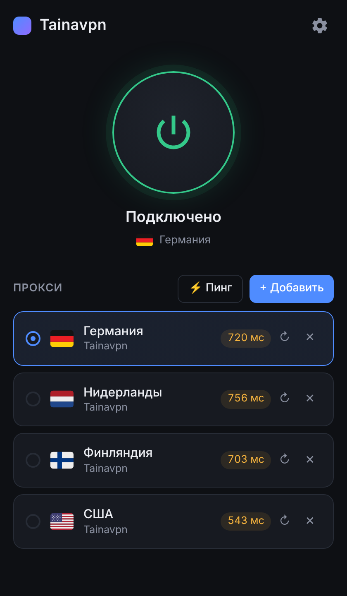

# Tainavpn

**Весь трафик устройства — через прокси нужной страны.** Windows, Android, Ubuntu.

Сайт: **[taina.sdsds.top](https://taina.sdsds.top)** · [Скачать последнюю версию](https://github.com/nshimanovskiy/TainaVPN/releases/latest) · [English](#english)

  

Tainavpn отправляет трафик всего устройства — браузера, мессенджеров, игр — через прокси. В списке видны страны с флагами:
выберите любую и нажмите одну кнопку. Если связь пропадёт, kill switch не даст трафику уйти мимо прокси.

## Как подключиться

1. **Получите ссылку‑подписку** у нашего Telegram‑бота — он выдаст личную ссылку и пришлёт файл приложения.
   Ссылку на бота можно найти на [сайте](https://taina.sdsds.top) и в самом приложении.
2. **Установите приложение** (см. ниже) и нажмите **+ Добавить → По ссылке**, вставьте ссылку.
3. **Выберите страну** и нажмите большую кнопку подключения.

## Скачать

| Система | Файл | Как установить |
|---|---|---|
| Windows 10 / 11 (64‑бит) | `Tainavpn-<версия>-windows-x64.exe` | установка не нужна — запустите файл; попросит права администратора (они нужны, чтобы направить в прокси весь трафик) |
| Android 7+ | `Tainavpn-<версия>-android.apk` | откройте файл и разрешите установку из этого источника |
| Ubuntu 22.04 / 24.04 | `tainavpn_<версия>_amd64.deb` | двойной клик или `sudo apt install ./tainavpn_<версия>_amd64.deb` — ярлык появится в меню приложений |

Все файлы — на странице [Releases](https://github.com/nshimanovskiy/TainaVPN/releases/latest) и на [сайте](https://taina.sdsds.top).
iPhone и iPad пока не поддерживаются.

## Возможности

- **Весь трафик, а не только браузер.** Приложение работает на уровне системы (TUN), поэтому в прокси идут все программы.
  На Windows и Ubuntu можно выбрать режим «Системный прокси» — тогда через прокси идут только программы, которые его поддерживают, и права администратора не нужны.
- **Kill switch.** Если VPN отключился или приложение упало, интернет блокируется, а не идёт напрямую (подробнее ниже).
- **Несколько стран.** По ссылке‑подписке приходит по одному прокси на каждую страну, страна показывается флагом и названием.
- **Проверка пинга.** Кнопка «⚡ Пинг» измеряет реальную задержку каждого прокси: зелёный — до 300 мс, жёлтый — до 800 мс, красный — больше.
- **DNS без утечек.** DNS‑запросы тоже идут через прокси. «Частный DNS» на Android поддерживается во всех режимах.
- **Свои прокси.** Вкладка «Свой прокси»: SOCKS5 или HTTP, строкой `логин:пароль@хост:порт` (или `http://…`, `хост:порт:логин:пароль`) либо по полям.
- **Обновления.** Приложение само проверяет новую версию и ставит её одной кнопкой («Настройки → Проверить обновления»).
- **Русский и английский.** Язык выбирается по системе, сменить можно в настройках.

## Kill switch

Включается в **Настройки → Kill switch**.

- **Windows и Ubuntu.** Пока VPN включён, трафик может идти только через него. Если приложение упадёт или ядро остановится, интернет
  останется заблокированным, пока вы не подключитесь снова или не нажмёте «Разблокировать интернет». Если вы сами нажали «Отключить»
  или закрыли приложение, блокировка снимается. Локальная сеть (принтеры, роутер) остаётся доступной.
  Работает в режиме «Весь трафик (TUN)». На Windows использует правила брандмауэра Windows, на Ubuntu — nftables.
- **Android.** Если VPN не смог запуститься, трафик блокируется, а не идёт мимо прокси. Чтобы быть защищённым и тогда, когда Android
  закрывает приложение, включите в настройках Android для Tainavpn **«Постоянная VPN»** и **«Блокировать соединения без VPN»** —
  в приложении есть кнопка, которая открывает эти настройки.

## Вопросы

**Нужны ли права администратора / root?**
Windows спросит права администратора при запуске — они нужны для режима «Весь трафик» и kill switch.
На Ubuntu пакет сам выдаёт программе нужные сетевые права, пароль спрашивается один раз — при установке.

**Где взять ссылку‑подписку?** В нашем Telegram‑боте. Ссылка личная, не передавайте её другим; если она утекла — выпустите в боте новую.

**Почему не работает звонок в мессенджере / игра по UDP?** Большинство SOCKS5‑прокси не поддерживают UDP. Сайты и приложения, работающие по TCP, работают.

**Где посмотреть, что происходит?** «Настройки → Логи ядра».

## Сборка из исходников

Приложения собираются в GitHub Actions (`.github/workflows/build.yml`); там же их проверяют тесты, включая запуск на эмуляторе Android
с «Частным DNS» и проверку kill switch. Новая версия выпускается, когда меняется номер в файле `VERSION`.

| Часть | Где | Сборка |
|---|---|---|
| Интерфейс (общий для всех платформ) | `ui/` | HTML/JS, строки переводов — `ui/i18n.js` |
| Ядро | `core/` | обёртка над [sing-box](https://github.com/SagerNet/sing-box) 1.14 |
| Windows / Ubuntu | `desktop/` | Go + [Wails](https://wails.io): `go build -tags desktop,production,with_gvisor,badlinkname,tfogo_checklinkname0 -ldflags=-checklinkname=0 ./desktop` (на Linux ещё `webkit2_41`) |
| Android | `mobile/`, `android/` | `gomobile bind -target=android -javapkg com.tainavpn ./mobile`, затем `gradle -p android assembleRelease` |

Требуется Go 1.25.5+. Для Android — JDK 17, Android SDK/NDK и `gomobile`.

**Подпись APK.** Без секретов `ANDROID_KEYSTORE_*` сборка подписывает APK тестовым ключом из репозитория — такие APK годятся только для проверки.

## Лицензия

[GPL-3.0](LICENSE). В основе — ядро [sing-box](https://github.com/SagerNet/sing-box) (GPL-3.0). Флаги — [Twemoji](https://github.com/jdecked/twemoji) (CC-BY 4.0).

---

## English

**Tainavpn sends all of your device's traffic through a proxy in the country you choose.** Windows, Android, Ubuntu.
Website: [taina.sdsds.top](https://taina.sdsds.top) · [Download](https://github.com/nshimanovskiy/TainaVPN/releases/latest)

1. Get your personal subscription link from our Telegram bot (it also sends the app).
2. Install the app, tap **+ Add → By link** and paste the link.
3. Pick a country and press the big button.

Features: system-wide (TUN) mode, kill switch, several countries with flags, ping check, DNS through the proxy (Android Private DNS supported),
your own SOCKS5/HTTP proxies, one-click updates, Russian and English UI. Built on [sing-box](https://github.com/SagerNet/sing-box). License: GPL-3.0.
